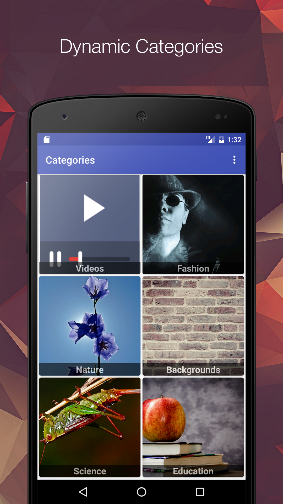
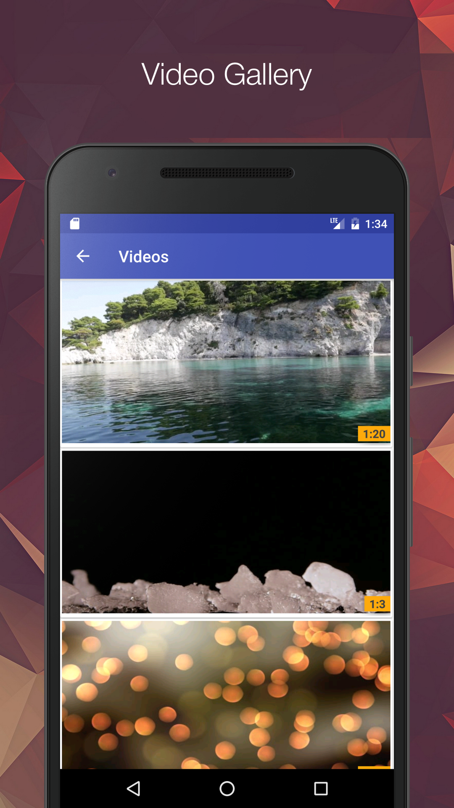
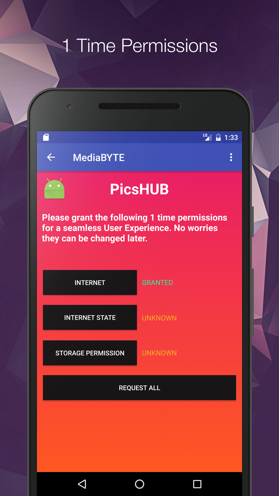
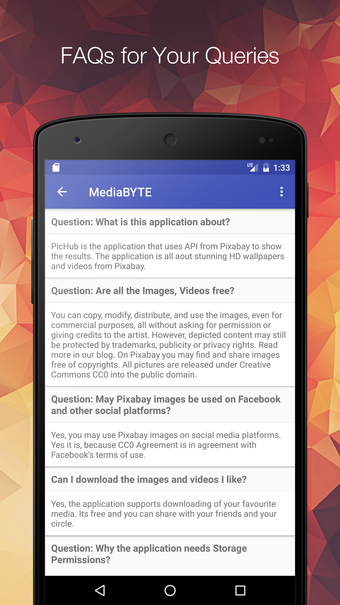

# Brightness App for Android
Brightness app for Android. The ultimate app to adjust screen brightness or call it a screen dimmer app . The app is a real handy utility for night owls. Awesome custom design makes it really appealing to use.
<figure>
    <figcaption>App Icon:</figcaption>
    
</figure>


## Idea:
The idea of the application came to me when started learning Android development, I started really with really simple things and grew myself over time with writing more and more code. The widget is a custom view that controls the brightness of the system.


## TLDR: Simple project during my intial phase and my personal need

## Screenshots:

| | |
|:-------------------------:|:-------------------------:|
|  SC 1 |  SC 2|
|  SC 3 |  SC 4|
|  SC 5 | |

## App Store Statistics:


## Working:
The app creates and starts Android service that continuosly monitors the changes in the system brightness and when the user opens the app it reads the current system brightness and manipulate it accordingly.

```java
    brightnessSeekbar.setOnSeekCircleChangeListener(new SeekCircle.OnSeekCircleChangeListener() {
        @Override
        public void onProgressChanged(SeekCircle seekCircle, int progress, boolean fromUser) {
            brightnessTV.setText(progress + "%");

            if (progress > minimum) {
                Settings.System.putInt(getContentResolver(), Settings.System.SCREEN_BRIGHTNESS, (int) (progress * 2.55));
                brightnessTV.setText(progress + "%");
            } else {
                seekCircle.setProgress(minimum);
                Settings.System.putInt(getContentResolver(), Settings.System.SCREEN_BRIGHTNESS, minimum);
                brightnessTV.setText(minimum + "%");
            }
        }

        @Override
        public void onStartTrackingTouch(SeekCircle seekCircle) {
        }

        @Override
        public void onStopTrackingTouch(SeekCircle seekCircle) {
        }
    });

```

## Libraries Used:
- Google Play Services backend
- Android About Page(https://github.com/medyo/android-about-page)
- RateMe Dialog Library ('com.androidsx:rate-me:4.0.3')

## Current Status:
Currently, the application is unpublished from the Play Store market. The reason being, the app has integrated ads and as per my student visa regulations in United States I am not allowed to have any source of passive income and I had to take the app down. I am planning on working on it and republish it without any ads for free.


