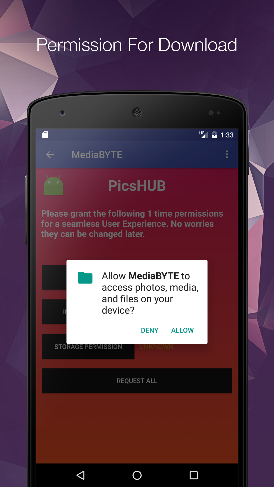

# MediaByte: Royalty free Images, Videos App for Android
MediaByte is a media download app that allow its users to download royalty free images and videos for free. Backed by Pixabay API, the app gets all its content from Pixabay and is free to use as per the terms by Pixabay. 

## Idea:
Individual project. The motivation for the app was to create my own media app like any other trending wallpaper or videos app in Play Store at the time. Most of the things are custom coded and implemented from scratch. All API calls handling over the network is implemented from scracth without using nay third party library. The project has been succeessful with a great help from Stackoverflow and amazing netizens that care, share and help people with their concerns and queries. 

## TLDR: Simple project to compete with trending media and wallpaper download apps and also curiosity cuz why not!!

## Screenshots:

| | |
|:-------------------------:|:-------------------------:|
|  SC 1 |  SC 2|
|  SC 3 |  SC 4|
|  SC 5 |   SC 6|
|  SC 7 |   SC 8|
|  SC 9 |   SC 10|
|  SC 11 |   SC 12|
|  SC 13 | |

## Working:
The app uses the Pixabay to query the website server backend to query the media files. The app uses FireBase for user registration, user notifications, user authorization. Also, uses custome imageview that allow pinch zoom-in, zoom-out and double tap to zoom-in/out. Custom dialog box is created to resemble the old iOS dialog box design. At the home screen, the application pulls images from all different categories, to show the user current trending pictures in each of these categories. Also, Picasso library is used to allow easy image caching.

## Project files:

## Libraries Used:
- Google Play Services backend
- Android About Page(https://github.com/medyo/android-about-page)
- RateMe Dialog Library ('com.androidsx:rate-me:4.0.3')
- Standard Android: RecyclerView, Design, Adapter
- PhotoView ('com.github.chrisbanes:PhotoView:1.3.1'
- OkHttp ('com.squareup.okhttp:okhttp:2.0.0')
- JSoup ('org.jsoup:jsoup:1.10.2')
- Glide ('com.github.bumptech.glide:glide:3.7.0')
- Picasso ('com.squareup.picasso:picasso:2.3.2')
- Firebase Database, Auth, Message, Notifications

## Current Status:
Currently, the application is unpublished from the Play Store market. The reason being, the app has integrated ads and as per my student visa regulations in United States I am not allowed to have any source of passive income and I had to take the app down. I am planning on working on it and republish it without any ads for free.

